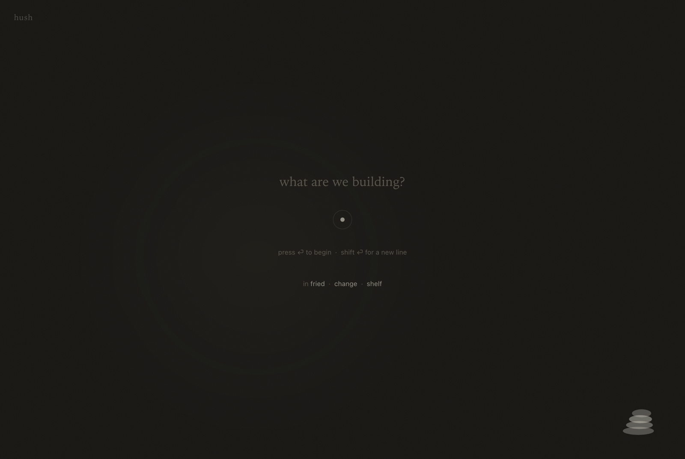
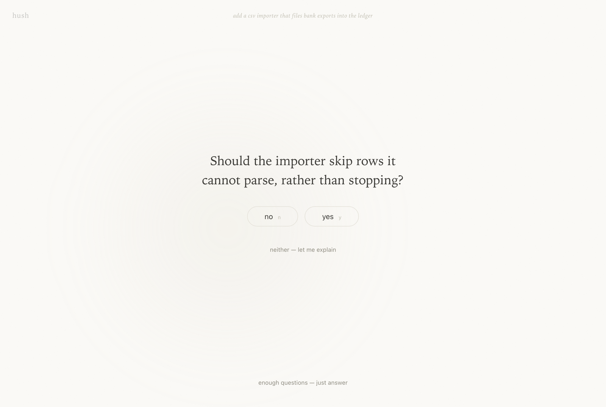
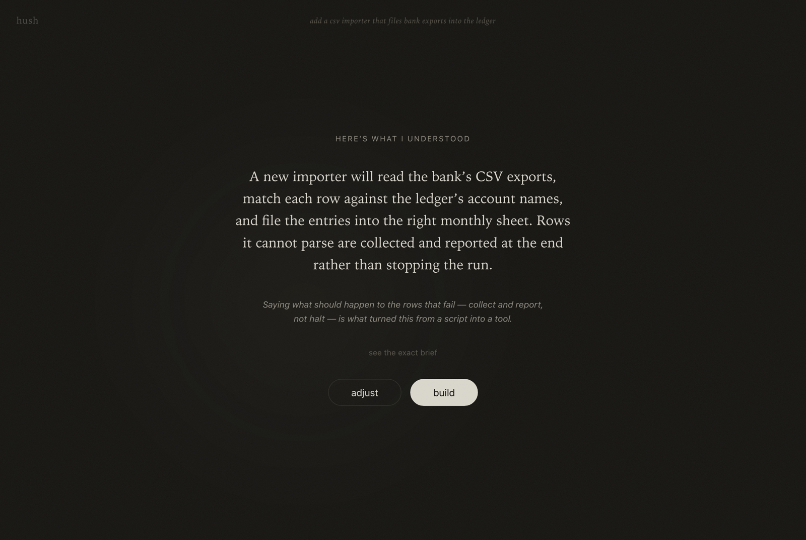
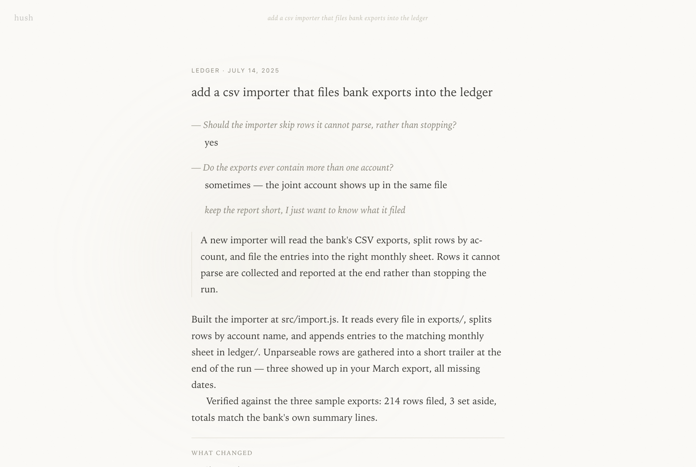

# hush

**Noise-canceling for Claude. Built for building.**

<p align="center">
  
</p>

A calm front door for coding with Claude Code. Pick a project, type (or
dictate) what you want built onto a quiet, fuzzy, near-blank screen. Claude
interviews *you* — one small question at a time, yes/no whenever possible,
grounded in an automatic scan of your repo — until it has the context it
needs. Then it builds, for real (reads and edits files, runs tests), while
the screen shows one slowly-crossfading line of activity. You get back a
short report: what changed (per-file +/− from git), one command to try it,
and **one** next step. No streaming text, no walls of options, no slot
machine.

## Why

Claude's answers are often so thorough they overwhelm: five options, twelve
caveats, three follow-up questions, all scrolling in at once. That's decision
fatigue by firehose. hush inverts the flow — the model absorbs the burden of
deciding what matters, and hands you back the smallest possible surface.

The feeling it aims for: creating software with the calmness of reading a
paperback in a park. Engaging but not chaotic. A canvas without the noise.

Design principles:

- **One thing on screen at a time.** A question, an answer, or a breath.
- **Nothing streams, nothing scrolls in.** Content resolves from a soft blur
  into focus, like fog lifting. Waiting is a breathing circle, not a spinner.
- **Yes/no beats open-ended.** Binary questions cost nothing to answer.
  A hard cap of 5 questions, with "enough — just answer" always available.
- **The calm answer contract.** One recommendation, never a menu. Under ~250
  words. Ends with exactly one smallest next step.
- **Coaching, quietly.** Before running, hush names the one piece of context
  that most sharpened the plan — so you learn what to include next time.
- **A book, not a feed.** A faint running head at the top of the page holds
  your place through the whole session. Finished sessions bind themselves
  into *stories* — the request, the interview as dialogue, the report, what
  changed — kept on a quiet shelf (`~/.hush/stories/`) you can reread like
  chapters. Report pages are typeset like book pages: ~66-character measure,
  ragged right, first-line paragraph indents.
- **The cairn.** Every build ends with one next step; the open ones stack
  into a small pile of stones in the corner of the home screen, the way
  hikers mark a trail. No badges, no counts, no red — a taller cairn simply
  means more is waiting. Open a stone to reread its story, or set it down
  when the step is done.
- **Review before you rest.** Each report carries a collapsed "see the full
  diff" — the whole working-tree diff, typeset quietly — so saying "done"
  can be an informed act, not a leap.

## A walk through

| | |
|:---:|:---:|
|  |  |
| *one question at a time* | *here's what I understood* |
|  |  |
| *every session becomes a story* | *the cairn holds your next steps* |

## Run it

Requires Node 18+ and the [`claude` CLI](https://claude.com/claude-code)
logged in (`claude` once, interactively, to authenticate). Your existing
OAuth account is used — no API key.

```sh
node server.mjs          # then open http://localhost:4117
```

or, for a chromeless app-style window on macOS:

```sh
bin/hush
```

## How it works

A dependency-free Node server shells out to `claude -p` in headless mode,
resuming one conversation per session with `--resume <session-id>`, with
`cwd` set to **your project** (so your repo's CLAUDE.md and conventions
apply):

1. **Elicit** — the server scans the project (structure, package scripts,
   git state, recent commits) and injects it as context; an appended system
   prompt turns Claude into a strict-JSON interviewer (`ask_yesno` /
   `ask_open` / `ready`) that never asks what the scan already answers. The
   interviewer can also read your code (read-only tools are free in headless
   mode), so briefs arrive grounded in real file paths. Runs on Sonnet for
   fast, cheap turns. The server enforces the 5-question cap.
2. **Ready** — Claude returns a summary, a coaching note, and the full build
   brief (inspectable behind a quiet disclosure). If your working tree is
   dirty, hush quietly suggests committing first. You confirm.
3. **Build** — the same conversation continues on your account's default
   model with `--output-format stream-json`; tool events become the single
   crossfading activity line. Permissions default to `acceptEdits` plus an
   allowlist of common build/test commands (npm, pytest, cargo, go, make,
   read-only git…). Set `HUSH_YOLO=1` to skip all permission checks instead.
4. **Report** — the server diffs a before/after git snapshot to show exactly
   what this run changed, and the calm contract keeps the report under 200
   words with a single NEXT step.

## Configuration (env vars)

| Var | Default | Meaning |
|---|---|---|
| `HUSH_PORT` | `4117` | server port |
| `HUSH_ELICIT_MODEL` | `sonnet` | model for interview turns |
| `HUSH_RUN_MODEL` | account default | model for the build phase |
| `HUSH_MAX_QUESTIONS` | `5` | hard cap on interview questions |
| `HUSH_RUN_TIMEOUT` | 20 min | build phase timeout (ms) |
| `HUSH_RUN_TOOLS` | see server.mjs | allowlisted tools for the build |
| `HUSH_YOLO` | off | `1` = `--dangerously-skip-permissions` |
| `HUSH_CLAUDE_BIN` | `claude` | path to the claude CLI |

Recent projects are remembered in `~/.hush/recents.json`.

## Roadmap

- Global hotkey / menu-bar summon (Raycast script command or Hammerspoon)
- Session history (quiet, opt-in)
- A quiet way to review the full diff before saying "done"
